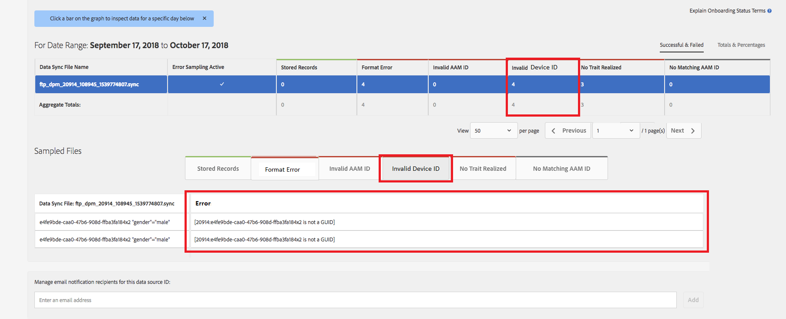

# 全局设备ID验证 {#global-device-id-validation}

设备广告标识符（即iDFA、GAID、Roku ID）具有必须满足的格式标准，才能在数字广告生态系统中使用。 现在，客户和合作伙伴可以将ID以任何格式上传到我们的全局数据源，而无需通知ID的格式是否正确。 此功能将对发送到全局数据源的设备ID进行验证以确定其格式正确，并在ID格式不正确时提供错误消息。 我们将支持验证 [!DNL iDFA]， [!DNL Google Advertising] 和 [!DNL Roku IDs] 在发射时。

## 格式标准概述 {#overview-of-format-standards}

以下是AAM当前识别和支持的全局设备广告ID池。 这些将以共享方式实施 [!UICONTROL Data Sources] 任何使用与这些平台用户绑定的数据的客户或数据合作伙伴都可以使用。

<table>
  <tr>
   <td>平台 </td>
   <td>AAM数据源ID </td>
   <td>ID格式 </td>
   <td>AAM PID </td>
   <td>注释 </td>
  </tr>
  <tr>
   <td>Google Android (GAID)</td>
   <td>20914</td>
   <td>32个十六进制数，通常表示为8-4-4-4-12<em>例如， 97987bca-ae59-4c7d-94ba-ee4f19ab8c21  </em> </td>
   <td>1352</td>
   <td>此ID必须以原始/未哈希/未更改的格式收集。参考 —  <a href="https://play.google.com/about/monetization-ads/ads/ad-id/">https://play.google.com/about/monetization-ads/ads/ad-id/</a></td>
  </tr>
  <tr>
   <td>Apple iOS (IDFA)</td>
   <td>20915</td>
   <td>32个十六进制数，通常表示为8-4-4-4-12 <em>示例， 6D92078A-8246-4BA4-AE5B-76104861E7DC  </em> </td>
   <td>3560</td>
   <td>此ID必须以原始/未哈希/未更改的格式收集。参考 —  <a href="https://support.apple.com/en-us/HT205223">https://support.apple.com/en-us/HT205223</a></td>
  </tr>
  <tr>
   <td>Roku (RIDA)</td>
   <td>121963</td>
   <td>32个十六进制数，通常表示为8-4-4-4-12 <em>例如，</em> <em>fcb2a29c-315a-5e6b-bcfd-d889ba19aada</em></td>
   <td>11536</td>
   <td>此ID必须以原始/未哈希/未更改的格式收集。参考 —  <a href="https://sdkdocs.roku.com/display/sdkdoc/Roku+Advertising+Framework">https://sdkdocs.roku.com/display/sdkdoc/Roku+Advertising+Framework</a> </td>
  </tr>
  <tr>
   <td>Microsoft Advertising ID (MAID)</td>
   <td>389146</td>
   <td>字母数字字符串</td>
   <td>14593</td>
   <td>此ID必须以原始/未哈希/未更改的格式收集。参考 —  <a href="https://docs.microsoft.com/en-us/uwp/api/windows.system.userprofile.advertisingmanager.advertisingid">https://docs.microsoft.com/en-us/uwp/api/windows.system.userprofile.advertisingmanager.advertisingid</a> <a href="https://msdn.microsoft.com/en-us/library/windows/apps/windows.system.userprofile.advertisingmanager.advertisingid.aspx">https://msdn.microsoft.com/en-us/library/windows/apps/windows.system.userprofile.advertisingmanager.advertisingid.aspx</a></td>
  </tr>
  <tr>
   <td>Samsung DUID</td>
   <td>404660</td>
   <td>字母数字字符串示例，7XCBNROQJQPYW</td>
   <td>15950</td>
   <td>此ID必须以原始/未哈希/未更改的格式收集。参考 —  <a href="https://developer.samsung.com/tv/develop/api-references/samsung-product-api-references/productinfo-api">https://developer.samsung.com/tv/develop/api-references/samsung-product-api-references/productinfo-api</a> </td>
  </tr>
</table>

## 在应用程序中设置广告标识符 {#setting-an-advertising-identifier-in-the-app}

在应用程序中设置广告商ID实际上是一个两步过程，首先检索广告商ID，然后将其发送到Experience Cloud。 执行这些步骤的链接如下所示。

1. 检索ID
   1. [!DNL Apple] 有关 [!DNL advertising ID] 可以找到 [此处](https://developer.apple.com/documentation/adsupport/asidentifiermanager).
   1. 有关设置 [!DNL advertiser ID] 对象 [!DNL Android] 可以找到开发人员 [此处](http://android.cn-mirrors.com/google/play-services/id.html).
1. 使用将其发送到Experience Cloud [!DNL setAdvertisingIdentifier] SDK中的方法
   1. 有关使用的信息 `setAdvertisingIdentifier` 位于 [文档](https://aep-sdks.gitbook.io/docs/using-mobile-extensions/mobile-core/identity/identity-api-reference#set-an-advertising-identifier) （对于两者） [!DNL iOS] 和 [!DNL Android].

`// iOS (Swift) example for using setAdvertisingIdentifier:`
`ACPCore.setAdvertisingIdentifier([AdvertisingId]) // ...where [AdvertisingId] is replaced by the actual advertising ID`

## DCS错误消息中提供的ID不正确  {#dcs-error-messaging-for-incorrect-ids}

当实时提交不正确的全局设备ID（IDFA、GAID等）给Audience Manager时，点击时将返回错误代码。 以下示例返回了错误，因为ID作为 [!DNL Apple IDFA]，其中只应包含大写字母，但ID中包含小写字母“x”。

请查看 [文档](https://experienceleague.adobe.com/docs/audience-manager/user-guide/api-and-sdk-code/dcs/dcs-api-reference/dcs-error-codes.html?lang=en#api-and-sdk-code) 以获取错误代码列表。

## 载入全局设备ID {#onboarding-global-device-ids}

除了实时提交全局设备ID之外，您还可以“[!DNL onboard]&quot;（上传）基于ID的数据。 此过程与根据客户ID载入数据时的过程相同（通常通过键/值对），但您只需使用适当的数据源ID，以便将数据分配给全局设备ID。 有关载入流程的文档可在以下位置找到： [文档](https://experienceleague.adobe.com/docs/audience-manager/user-guide/implementation-integration-guides/sending-audience-data/batch-data-transfer-process/batch-data-transfer-overview.html?lang=en#implementation-integration-guides). 请记住，根据您使用的平台，使用全局数据源ID。

如果通过载入流程提交了错误的全局设备ID，则错误将显示在 [[!DNL Onboarding Status Report]](https://experienceleague.adobe.com/docs/audience-manager/user-guide/reporting/onboarding-status-report.html?lang=en#reporting).

以下是通过该报表产生的错误的示例：

