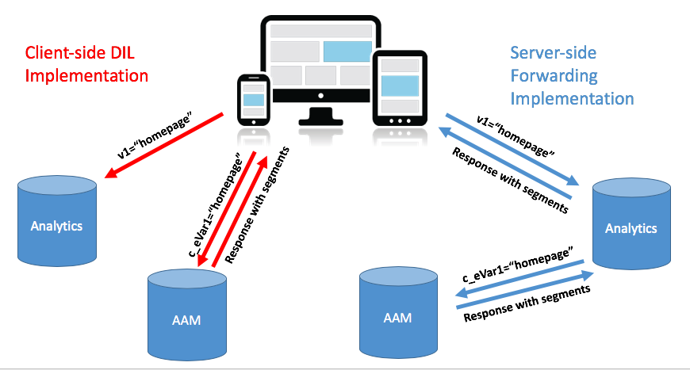
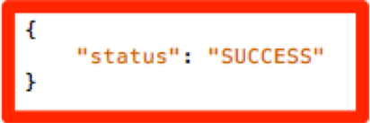

# 将网站的Audience Manager实施从客户端DIL迁移到服务器端转发 {#migrating-your-site-s-aam-implementation-from-client-side-dil-to-server-side-forwarding}

如果您同时具有Adobe Audience Manager(AAM)和Adobe Analytics，并且当前正在使用DIL([!DNL Data Integration Library])代码，并且还会将点击从页面发送到Adobe Analytics。 由于您有这两个解决方案，并且它们都是Adobe Experience Cloud的一部分，因此您有机会遵循启用服务器端转发的最佳实践，该实践支持 [!DNL Analytics] 数据收集服务器可将网站分析数据实时转发到Audience Manager，而无需让客户端代码将页面中的其他点击发送到AAM。 本教程将指导您完成以下步骤：从旧的客户端DIL实施切换到较新的服务器端转发方法。

## 客户端(DIL)与服务器端 {#client-side-dil-vs-server-side}

比较这两种将Adobe Analytics数据导入AAM的方法并进行对比时，首先可能有助于显示下图中的差异：

### 客户端DIL实施 {#client-side-dil-implementation}

如果使用此方法将Adobe Analytics数据导入AAM，则会有来自网页的两个点击：一个 [!DNL Analytics]，并转到AAM(在复制了 [!DNL Analytics] 网页上的数据。 [!UICONTROL Segments] 会从AAM返回到页面，以便用于个性化等。 这被视为旧版实施，不再建议这样做。

除了没有遵循最佳实践外，使用此方法的缺点还包括：

* 来自页面的两次点击，而不是仅一次点击
* 实时将AAM受众共享到时需要服务器端转发 [!DNL Analytics]，因此客户端实施不允许使用此功能（将来可能还会使用其他功能）

建议您转到AAM实施的服务器端转发方法。

### 服务器端转发实施 {#server-side-forwarding-implementation}

如上图所示，点击从网页到Adobe Analytics。 [!DNL Analytics] 然后，将数据实时转发到AAM，并对访客进行评估， [!UICONTROL segments]，就像点击是直接从页面进行一样。

[!UICONTROL Segments] 在同一实时点击时返回到 [!DNL Analytics]，它会将响应转发到网页以进行个性化，等等。

移动到服务器端转发没有时间下限。 Adobe强烈建议同时具有Audience Manager和 [!DNL Analytics] 使用此实施方法。

## 您有两项主要任务 {#you-have-two-main-tasks}

这页上有很多信息，当然，这都很重要。 但是， **总之，你需要做两件主要的事**:

1. 将您的代码从客户端DIL代码更改为服务器端转发代码
1. 在 [!DNL Analytics] [!DNL Admin Console] 开始实际转发数据(根据 [!UICONTROL report suite])

如果您跳过其中任一任务，则服务器端转发将无法正常工作。 此文档中已添加步骤和其他数据，以帮助您为设置正确执行这两个步骤。

## 实施选项 {#implementation-options}

从客户端转发到服务器端转发时，您将完成的任务之一是将代码更改为新的服务器端转发代码。 可使用以下选项之一完成此操作：

* Adobe Experience Platform标记 — Adobe针对Web属性的推荐实施选项。 您会看到，这是一项简单的任务，因为Platform标记已经为您完成了所有辛苦的工作。
* 在页面上 — 您还可以将新的SSF代码直接放置到 `doPlugins` 函数 `appMeasurement.js` 文件，如果您（尚）未使用LaunchAdobe
* 其他标签管理器 — 可以像处理上一个（在页面上）选项一样处理这些标签，因为您仍会将SSF代码放置在 `doPlugins`，其他标签管理器存储 [!DNL AppMeasurement] 代码

下面的每个内容 _更新代码_ 中。

## 实施步骤 {#implementation-steps}

以下步骤描述了实施。

### 步骤0:先决条件：Experience CloudID服务(ECID) {#step-prerequisite-experience-cloud-id-service-ecid}

移动到服务器端转发的主要先决条件是实施Experience CloudID服务。 如果您使用Experience Platform Launch，这非常容易完成，在这种情况下，您只需安装ECID扩展，然后它就会完成其余的操作。

如果您使用的是非AdobeTMS，或者根本没有TMS，请实施ECID以运行 **之前** 任何其他Adobe解决方案。 请参阅 [ECID文档](https://experienceleague.adobe.com/docs/id-service/using/home.html) 以了解更多详细信息。 其他唯一先决条件是与代码版本有关，因此，由于您只需在以下步骤中应用代码的最新版本，因此您将可以正常使用。

>[!NOTE]
>
>请在实施之前阅读此完整文档。 以下“时间”部分包含有关 *when* 您应实施每个内容，包括ECID（如果尚未实施）。

### 步骤1:从DIL代码中记录当前使用的选项 {#step-record-currently-used-options-from-dil-code}

在您准备好从客户端DIL代码移动到服务器端转发时，第一步是识别您对DIL代码执行的所有操作，包括自定义设置和发送到AAM的数据。 需要注意和考虑的事项包括：

* 正常 [!DNL Analytics] 变量，使用 `siteCatalyst.init` DIL模块 — 您无需担心此模块，因为其工作只是发送正常 [!DNL Analytics] 变量，并且这仅通过启用服务器端转发来实现。
* 合作伙伴子域 — 在 `DIL.create` 函数，请记下 `partner` 参数。 这称为您的“合作伙伴子域”，有时也称为“合作伙伴ID”，在您放置新的服务器端转发代码时，将需要使用此ID。
* [!DNL Visitor Service Namespace]  — 也称为“[!DNL Org ID]&quot;或&quot;[!DNL IMS Org ID]，”在设置新的服务器端转发代码时，您也将需要此代码。 记下来。
* containerNSID、uuidCookie和其他高级选项 — 记下您使用的任何其他高级选项，以便您也可以在服务器端转发代码中设置它们。
* 其他页面变量 — 如果其他变量从页面发送到AAM(除了常规 [!DNL Analytics] 变量（由siteCatalyst.init处理）时，您需要记下这些变量，以便它们可以通过服务器端转发发送(扰动程序警报：通过 [!DNL contextData] 变量)。

### 步骤2:更新代码 {#step-updating-the-code}

在 [实施选项](#implementation-options) （上面），提供了有关如何以及在何处实施服务器端转发的多个选项。 为了使此部分生效，我们需要将其划分为以下部分（其中两个部分合并）。 转到此部分最能描述您需求的方法。

#### Adobe Experience Platform标记 {#launch-by-adobe}

请观看以下视频，了解如何在Experience Platform Launch中将实施选项从客户端DIL代码移动到服务器端转发。

>[!VIDEO](https://video.tv.adobe.com/v/26310/?quality=12)

#### “在页面上”或非Adobe标签管理器 {#on-the-page-or-non-adobe-tag-manager}

请观看以下视频，了解有关将实施选项从客户端DIL代码移至 [!DNL AppMeasurement] 代码，驻留在文件或非Adobe标签管理系统中。

>[!VIDEO](https://video.tv.adobe.com/v/26312/?quality=12)

### 步骤3:启用转发(每个 [!UICONTROL Report Suite]) {#step-enabling-the-forwarding-per-report-suite}

在本教程中，我们已花费所有时间将代码从客户端DIL代码切换到服务器端转发。 这没关系，因为那是比较困难的部分。 尽管您会看到此部分非常简单，但它与更新代码一样重要。 在此视频中，您将看到如何翻转开关，以启用数据从Analytics实际转发到Audience Manager。

>[!VIDEO](https://video.tv.adobe.com/v/26355/?quality-12)

**注意：** 如视频中所述，请记住，在Experience Cloud后端完全启用转发需要长达4小时的时间。

## 计时 {#timing}

请注意，从客户端DIL转移到服务器端转发有两项主要任务：

1. 更新代码
1. 在 [!DNL Analytics] [!DNL Admin Console]

但问题是，你先做哪个？ 重要吗？ 好，抱歉，那是两个问题。 但答案……视情况而定，是的 *can* 重要。 这个怎么用含糊的？ 我们把它拆了。 但首先，如果您是拥有众多网站的大型组织，则还会出现一个额外的问题：我必须立刻做一切吗？ 那个比较容易。 不。 你可以一个接一个地做。

### 再深一点 {#a-little-deeper-dive}

时间和顺序之所以重要是因为转发方式 _真的_ 工作情况，可归纳为以下几个技术事实：

* 如果您实施了Experience CloudID服务(ECID)，并且在 [!DNL Analytics] [!DNL Admin Console] （“交换机”）已打开，数据将从 [!DNL Analytics] 到AAM，即使您尚未更新代码。
* 如果您未实施ECID，则即使您已打开开关，并且具有服务器端转发代码，数据也不会转发。
* 服务器端转发代码（无论是在Platform标记中还是页面上）可以真正处理响应，这是完成迁移所必需的。
* 请记住，服务器端转发交换机由 [!UICONTROL report suite]，但代码由Platform标记中的属性处理，或由 [!DNL AppMeasurement] 文件。

### 最佳实践 {#best-practices}

根据这些技术详细信息，以下是有关何时何地执行操作的建议：

#### 如果您尚未实施ECID {#if-you-do-not-have-ecid-yet-implemented}

1. 将开关翻转 [!DNL Analytics] 每个 [!UICONTROL report suite] 用于服务器端转发的附加信息。

   1. 由于您没有ECID，因此尚未启动转发。

1. 对于每个网站，将您的代码从客户端DIL更新为服务器端转发（这可能位于Platform标记中），或在页面上更新，如上面其他部分所述。

   1. 转发现在会流量化（您添加了ECID），您还应会收到正确的JSON响应 [!DNL Analytics] 信标（有关更多详细信息，请参阅下面的验证和疑难解答部分）。

#### 如果您已实施ECID {#if-you-do-have-ecid-implemented}

1. 准备并规划，以便您准备好将代码从DIL更新为PER服务器端转发 [!UICONTROL report suite] 服务器端转发所启用的附加内容(I):

   1. 将开关翻转 [!DNL Analytics] 启用服务器端转发。

      1. 转发将启动，因为您已启用ECID。
   1. 请尽快将您的代码从客户端DIL更新为单端转发（这可能位于Platform标记中或页面上，如上面其他部分所述）。

      1. 您应会收到正确的JSON响应 [!DNL Analytics] 信标(请参阅 [验证和疑难解答](#validation-and-troubleshooting) 部分，以了解更多详细信息)。

>[!NOTE]
>
>务必要尽可能地将这两个步骤相互接近，因为在上面的步骤1和2之间，您将会有进入AAM的重复数据。 换言之，单端转发将开始从 [!DNL Analytics] 到AAM，并且由于DIL代码仍在页面上，因此还会有一个从页面直接进入AAM的点击，从而使数据翻倍。 一旦您将代码从DIL更新到服务器端转发，这种情况就会减轻。

>[!NOTE]
>
>如果您希望在数据方面存在细微差异，而不是在数据方面有少量重复，则可以切换上面步骤1和2的顺序。 将代码从DIL移动到服务器端转发会阻止数据流入AAM，直到您能够翻转交换机以打开 [!UICONTROL report suite]. 通常，客户宁可将数据稍微翻倍，也不会错过让访客了解特征和 [!UICONTROL segments].

#### 迁移时间(当您拥有多个网站和 [!UICONTROL report suites] {#migration-timing-when-you-have-many-sites-and-report-suites}

本主题在前几节中作了简要介绍，主要战略可概括如下：

迁移一个站点/[!UICONTROL report suite] (或一组网站/[!UICONTROL report suites])。

但是，基于一些可能的情况，这可能会有些棘手：

* 您的网站包含多个不同的 [!UICONTROL report suites]
* 您拥有 [!UICONTROL report suite] 包括多个网站(如 [!UICONTROL report suite])
* 您可以使用一个Platform标记属性覆盖多个网站
* 您有不同的开发团队，负责不同的站点

因为这些东西，它会变得有点复杂。 我最能建议的是：

* 请花些时间，根据上面所述制定迁移到服务器端转发的策略
* 基于Platform标记中的单个属性(或 [!DNL AppMeasurement] 文件)通常映射到1个或2个不同的 [!UICONTROL report suites]，则您可能能够制定一个计划，逐个对这些不同的组运行，并更新企业到服务器端转发
* 如果您与Adobe咨询团队合作，请与他们讨论您的迁移计划，以便他们在需要时获得帮助

## 验证和疑难解答 {#validation-and-troubleshooting}

验证服务器端转发是否已启动且正在运行的主要方法是，查看应用程序针对任意Adobe Analytics点击的响应。

如果您没有对 [!DNL Analytics] Audience Manager时，对 [!DNL Analytics] 信标（除2x2像素以外）。 但是，如果您正在执行服务器端转发，则可以在 [!DNL Analytics] 请求和响应，以告知您 [!DNL Analytics] 与Audience Manager正确通信、转发点击并获取响应。

>[!VIDEO](https://video.tv.adobe.com/v/26359/?quality=12)

>[!WARNING]
>
>请注意虚假的“成功”消息。 如果有响应，并且一切似乎都运行正常，请确保您具有 `stuff` 对象。 如果没有，您可能会看到一条消息，显示 `"status":"SUCCESS"`. 尽管这听起来很不可思议，但实际上却证明它没有正常运行。
>
>如果您看到此消息，则表示您已在Platform标记或 [!DNL AppMeasurement]，但是 [!DNL Analytics] [!DNL Admin Console] 尚未完成。 在这种情况下，您需要验证是否已在 [!DNL Analytics] [!DNL Admin Console] , [!UICONTROL report suite]. 如果您已经执行了操作，但尚未满4小时，请耐心等待，因为在后端进行所有必要的更改可能需要那么长时间。

有关服务器端转发的更多信息，请参阅 [文档](https://experienceleague.adobe.com/docs/analytics/admin/admin-tools/server-side-forwarding/ssf.html).
