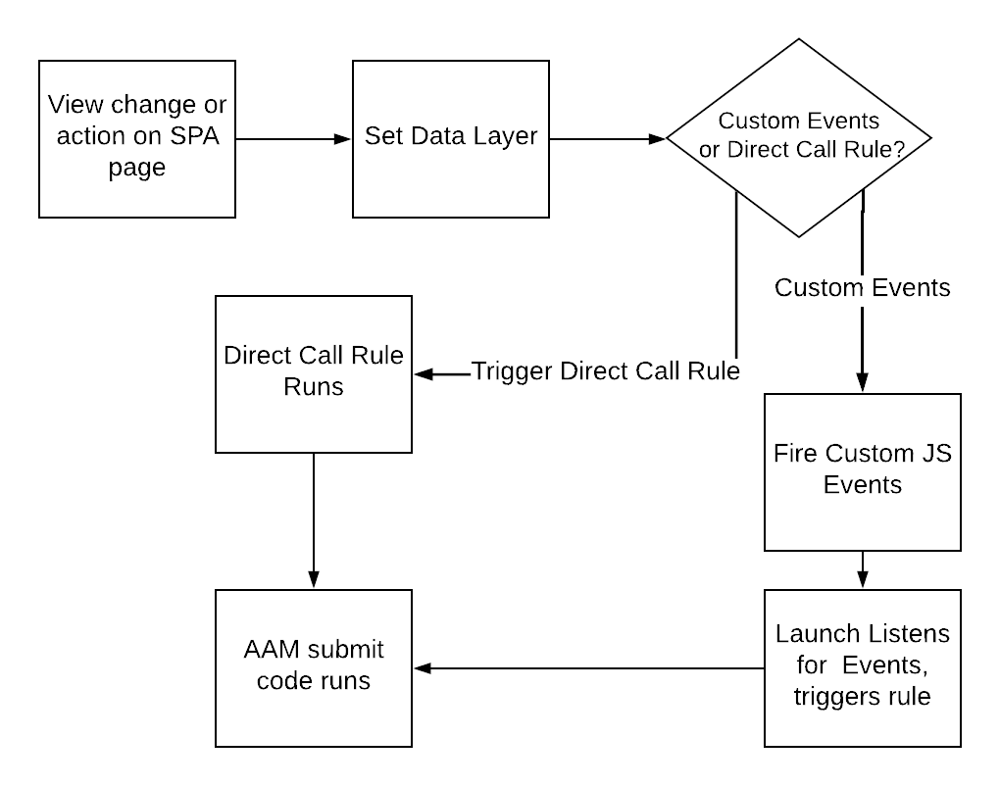

# 在向SPA发送数据时，在AAM页面上使用最佳实践 {#using-best-practices-on-spa-pages-when-sending-data-to-aam}

本文档介绍了将数据从单页应用程序(SPA)发送到Adobe Audience Manager (AAM)的几个最佳实践。 本文重点介绍如何使用 [!UICONTROL Experience Platform tags]，推荐的实施方法。

## 初始注释

* 以下项目将假设您使用Platform标记在您的网站上实施。 如果您未使用Platform标记，则这些注意事项仍然存在，但您需要根据实施方法调整它们。
* 所有SPA都不相同，因此您可能需要调整以下某些项目以最好地满足您的要求，但Adobe希望与您分享一些在将数据从SPA页面发送到Audience Manager时需要考虑的最佳实践。

## 在Experience Platform标记（以前称为Launch）中使用SPA和AAM的简单图表{#simple-diagram-of-working-with-spas-and-aam-in-experience-platform-launch}

>[!NOTE]
>如前所述，这是一个简化的图表，说明了如何使用Platform标记在Adobe Audience Manager实施(不包括Adobe Analytics)中处理SPA页面。 正如您所看到的，这是相当直截了当的，主要决定是如何将视图更改（或操作）传达给Platform标签。

## 从SPA页面触发标记 {#triggering-launch-from-the-spa-page}

在Platform标记中触发规则(并因此将数据发送到Audience Manager)的两种更常见方法是：

* 设置JavaScript自定义事件（请参阅示例） [此处](https://helpx.adobe.com/analytics/kt/using/spa-analytics-best-practices-feature-video-use.html) 使用Adobe Analytics)
* 使用 [!UICONTROL Direct Call Rule]

在此Audience Manager示例中，您使用 [!UICONTROL Direct Call rule] ，以触发进入Audience Manager的点击。 正如您将在下一节中所看到的，通过设置 [!UICONTROL Data Layer] 到新值，以便被 [!UICONTROL Data Element] 在Platform标记中。

## 演示页面 {#demo-page}

下面是一个小页面，演示如何更改数据层中的值并将其发送到Audience Manager中，就像在SPA页面上执行操作一样。 可以对此功能进行建模，以便进行更详细的必要更改。 您可以找到此演示页面 [此处](https://aam.enablementadobe.com/SPA-Launch.html).

## 设置数据层 {#setting-the-data-layer}

如前所述，当在页面上加载新内容或在网站上执行操作时，需要在页面头动态设置数据层，然后才能调用和运行Platform标记 [!UICONTROL rules]，以便Platform标记能够从数据层中获取新值并将它们推送到Audience Manager中。

如果您转到上面列出的演示站点并查看页面源，您将看到：

* 数据层位于页面顶部，在调用Platform标记之前
* 模拟SPA链接中的JavaScript会更改 [!UICONTROL Data Layer]，然后调用Platform标记( `_satellite.track()` 调用)。 如果您使用的是JavaScript自定义事件，而不是 [!UICONTROL Direct Call Rule]，教训是一样的。 首先更改 [!DNL data layer]，然后调用Platform标记。

>[!VIDEO](https://video.tv.adobe.com/v/23322/?quality=12)

## 其他资源 {#additional-resources}

* [Adobe论坛上的SPA讨论](https://forums.adobe.com/thread/2451022)
* [参考架构站点，该站点说明如何在Platform标记中实施SPA](https://helpx.adobe.com/experience-manager/kt/integration/using/launch-reference-architecture-SPA-tutorial-implement.html)
* [在Adobe Analytics中跟踪SPA时使用最佳实践](https://helpx.adobe.com/analytics/kt/using/spa-analytics-best-practices-feature-video-use.html)
* [用于本文的演示站点](https://aam.enablementadobe.com/SPA-Launch.html)
